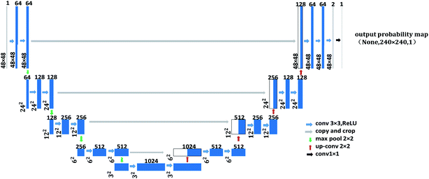

# Image noise reduction

Image-noise-reduction은 CNN 신경망을 사용해서 이미지 품질을 개선하는 모델이다. 

- **ResNet**: 출처는 [Deep Residual Learning for Image Recognition](https://arxiv.org/abs/1512.03385) (CVPR 2015)와 [Identity Mappings in Deep Residual Networks](https://arxiv.org/abs/1603.05027) (CVPR 2016) 선택 옵션으로 ImageNet에서 사전 훈련된 가중치를 load 한다.


1. V1

```
tf.keras.applications.ResNet101(
    include_top=True,
    weights="imagenet",
    input_tensor=None,
    input_shape=None,
    pooling=None,
    classes=1000,
    **kwargs
)
```

2. V2

```
tf.keras.applications.ResNet101V2(
    include_top=True,
    weights="imagenet",
    input_tensor=None,
    input_shape=None,
    pooling=None,
    classes=1000,
    classifier_activation="softmax",
)
```

보다시피 `classifier_activation` parameter가 더해졌고, 이것은 `str` 혹은 callable 이다. "top" 레이어에서 사용할 활성함수이다. `include_top=True`가 아니면 무시된다. 탑 레이어의 로짓을 반환하려면 `classifier_activation=None`을 설정한다. 

- **UNet**: 레퍼런스는 [U-Net: Convolutional Networks for Biomedical Image Segmentation](https://arxiv.org/abs/1505.04597) 이며, DNN에서 labeled train sample이 필요하다는 배경에서 시작된다. Data augmentation을 적극 활용하는 네트워크 및 전략이다. 아키텍처는 두가지 경로로 구성되어 하나는 정확한 위치 파악, 하나는 컨텍스트를 캡쳐한다. 현미경 이미지에 대해 학습된 네트워크를 사용해서 우수성 입증하였다. 



===

# Installation

본인은 Windows 10, Python 3.8, tensorflow 2.5.0, cudatoolkit 11.3.1, cudnn 8.2.1 에서 실습하였고 하드웨어는 로컬 GPU(GeForce GTX 960M)만을 사용했다. 모델을 훈련 방법은:

```
python learn.py
```

이고 `config.py`에서 이미지 사이즈, 배치 사이즈, Epoch등을 수정하여 사용할 수 있다. 모델 결과를 추론하기 위하여 `predict.py` 에서 추론결과와 RMSE, PSNR 값을 계산하는 메서드를 정의한 후 `estimate.ipynb` 을 ipython 등에서 실행하여 훈련한 모델을 적용할 수 있다.

===

예시로 훈련했을때는,

```
Epoch 1/5
1300/1300 [==============================] - 16873s 13s/step - loss: 0.2761 - val_loss: 0.1835
Epoch 2/5
1300/1300 [==============================] - 16908s 13s/step - loss: 0.2001 - val_loss: 0.1626
Epoch 3/5
1300/1300 [==============================] - 17184s 13s/step - loss: 0.1626 - val_loss: 0.1508
Epoch 4/5
1300/1300 [==============================] - 17999s 14s/step - loss: 0.1350 - val_loss: 0.1365
Epoch 5/5
1300/1300 [==============================] - 17375s 13s/step - loss: 0.1126 - val_loss: 0.1223
```

의 결과를 보였고 추론시에 PSNR은 입력의 79%정도로 낮아졌음을 확인할 수 있다. 입력 이미지 사이즈가 크고 Epoch를 많이 반복하면 보다 나은 결과를 얻을 것이다. 